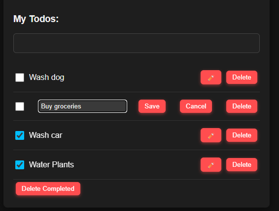

# Todo List App with Elmish Architecture and PHP Backend

This project is a simple, interactive Todo List application implemented using **JavaScript** and inspired by the **Elmish** architecture.
It now includes a **PHP + SQLite backend** for persistence, allowing todos to remain saved across page reloads.

It demonstrates state management, event-driven updates, a clean separation of concerns between **Model**, **Update**, and **View**, and backend communication.

---

## Screenshot



*Example of the app with todos, inline editing, and completed tasks.*

---

## Table of Contents

* [Features](#features)
* [Getting Started](#getting-started)
* [Backend Setup](#backend-setup)
* [Project Structure](#project-structure)
* [Elmish Architecture Overview](#elmish-architecture-overview)
* [Code Examples](#code-examples)
* [Technologies Used](#technologies-used)
* [Running Instructions](#running-instructions)
* [Running Locally / Lokal starten](#running-locally--lokal-starten)
* [Database](#database)
* [Deployment](#deployment)
* [Author](#author)

---

## Features

* Add, edit, and delete todo items
* Toggle completion status
* Delete all completed tasks
* Edit todo text inline
* Sleek, dark-themed UI with hover and focus effects
* Smooth button animations
* Persistent storage via **PHP + SQLite backend**

---

## Getting Started

1. Clone the repository:

```bash
git clone https://github.com/sandroc0sta/todo-app
```

2. Make sure you have **PHP** installed locally (or XAMPP for Windows).

3. Start the PHP server in the project folder:

```bash
cd todo-app
php -S localhost:8000
```

4. Open your browser and navigate to:

```
http://localhost:8000/index.html
```

Todos are now stored persistently in the SQLite database.

---

## Backend Setup

The backend uses **PHP** and **SQLite**:

* `backend.php` handles all CRUD operations:

  * `action=get` → fetch all todos
  * `action=add` → add a new todo (returns assigned `id`)
  * `action=toggle` → toggle completion by todo **ID**
  * `action=delete` → delete a specific todo by **ID**
  * `action=delete_completed` → delete all completed todos
  * `action=save` → update text of a todo by **ID**

* `todos.db` stores todos in a SQLite table:

```sql
CREATE TABLE IF NOT EXISTS todos (
  id INTEGER PRIMARY KEY AUTOINCREMENT,
  text TEXT NOT NULL,
  completed INTEGER DEFAULT 0
);
```

* JavaScript `dispatch` calls the backend using `fetch()` after updating the local model, keeping the UI responsive while syncing with the database.

---

## Project Structure

The application follows an **Elmish-inspired architecture** with three main parts:

### Model

Represents the application state, including the list of todos:

```javascript
function init() {
  return {
    todos: [] // Each todo: { id, text, completed, editing, new }
  };
}
```

### Update

Handles all messages/events, updating the model immutably. All actions are now **ID-based**:

```javascript
function update(msg, model, payload) {
  switch(msg) {
    case MSG.ADD_TODO:
      return { ...model, todos: [...model.todos, { id: payload.id, text: payload.text, completed: false, editing: false, new: true }] };
    case MSG.TOGGLE_TODO:
      return { ...model, todos: model.todos.map(todo => todo.id === payload ? { ...todo, completed: !todo.completed } : todo) };
    case MSG.DELETE_TODO:
      return { ...model, todos: model.todos.filter(todo => todo.id !== payload) };
    case MSG.DELETE_COMPLETED:
      return { ...model, todos: model.todos.filter(todo => !todo.completed) };
    case MSG.EDIT_TODO:
      return { ...model, todos: model.todos.map(todo => todo.id === payload ? { ...todo, editing: !todo.editing } : todo) };
    case MSG.SAVE_TODO:
      return { ...model, todos: model.todos.map(todo => todo.id === payload.id ? { ...todo, text: payload.text, editing: false } : todo) };
  }
}
```

### View

Renders the UI and dispatches messages, using the **todo ID** for all backend interactions.

---

## Elmish Architecture Overview

1. **Model**: Holds the app state (`todos` array).
2. **Update**: Pure function computing new state from current state and messages.
3. **View**: Renders the UI from the model and dispatches messages from user actions.

This ensures **predictable, maintainable, and testable code**.

---

## Database

* **`todos.db`**: The main SQLite database used by the backend. Stores all todos persistently.
* **Structure:** Each todo has `id`, `text`, and `completed` columns.
* **`database.sqlite`**: Not used by the current backend; can be ignored or deleted.
* Backend automatically creates the table if it doesn’t exist.

---

## Running Locally / Lokal starten

#### English

1. Install XAMPP (or PHP).
2. Copy the project folder into `htdocs` (for XAMPP).
3. Start Apache.
4. Open `http://localhost/<your-project-folder>/`.

#### Deutsch

1. XAMPP installieren (oder PHP lokal).
2. Projektordner in `htdocs` kopieren.
3. Apache starten.
4. Browser öffnen: `http://localhost/<dein-projekt-ordner>/`.

---

## Deployment

* **Local:** PHP built-in server or XAMPP/MAMP/LAMP.
* **Online:** PHP-enabled hosting, upload all project files (`index.html`, `main.js`, `css`, `backend.php`, `todos.db`).
* **GitHub:** Version control only; GitHub Pages cannot run PHP.

---

## Author

Sandro Costa

---

# Todo-Listen-App mit Elmish-Architektur und PHP-Backend (Deutsch)

Dieses Projekt ist eine einfache, interaktive Todo-Listen-Anwendung, implementiert mit **JavaScript** und inspiriert von der **Elmish-Architektur**.
Es enthält nun ein **PHP + SQLite Backend** für persistente Speicherung, sodass Todos auch nach dem Neuladen der Seite erhalten bleiben.

Die App demonstriert **Zustandsverwaltung**, **ereignisgesteuerte Updates**, eine saubere Trennung zwischen **Model**, **Update** und **View** sowie die Kommunikation mit dem Backend.

---

## Screenshot


*Beispiel der App mit Todos, Inline-Bearbeitung und erledigten Aufgaben.*

---

## Inhaltsverzeichnis

* [Funktionen](#funktionen)
* [Erste Schritte](#erste-schritte)
* [Backend Setup](#backend-setup)
* [Projektstruktur](#projektstruktur)
* [Elmish-Architektur Übersicht](#elmish-architektur-übersicht)
* [Code-Beispiele](#code-beispiele)
* [Verwendete Technologien](#verwendete-technologien)
* [Anleitung zum Ausführen](#anleitung-zum-ausführen)
* [Lokal starten / Running Locally](#lokal-starten--running-locally)
* [Datenbank](#datenbank)
* [Deployment](#deployment)
* [Autor](#autor)

---

## Funktionen

* Todo-Elemente hinzufügen, bearbeiten und löschen
* Erledigt-Status umschalten
* Alle erledigten Aufgaben löschen
* Inline-Bearbeitung von Todo-Text
* Dunkles, modernes Design mit Hover- und Fokuseffekten
* Sanfte Button-Animationen
* Persistente Speicherung über **PHP + SQLite Backend**

---

## Erste Schritte

1. Repository klonen:

```bash
git clone <repository-url>
```

2. Stelle sicher, dass **PHP** lokal installiert ist (oder XAMPP für Windows).

3. Starte den PHP-Server im Projektordner:

```bash
cd todo-app
php -S localhost:8000
```

4. Öffne den Browser und gehe zu:

```
http://localhost:8000/index.html
```

Die Todos werden nun persistent in der SQLite-Datenbank gespeichert.

---

## Backend Setup

Das Backend nutzt **PHP** und **SQLite**:

* `backend.php` verarbeitet alle CRUD-Operationen:

  * `action=get` → Alle Todos abrufen
  * `action=add` → Neues Todo hinzufügen (gibt `id` zurück)
  * `action=toggle` → Erledigt-Status nach Todo-**ID** umschalten
  * `action=delete` → Bestimmtes Todo nach **ID** löschen
  * `action=delete_completed` → Alle erledigten Todos löschen
  * `action=save` → Text eines Todos nach **ID** aktualisieren

* `todos.db` speichert Todos in einer SQLite-Tabelle:

```sql
CREATE TABLE IF NOT EXISTS todos (
  id INTEGER PRIMARY KEY AUTOINCREMENT,
  text TEXT NOT NULL,
  completed INTEGER DEFAULT 0
);
```

* JavaScript `dispatch` ruft das Backend per `fetch()` auf, nachdem das lokale Modell aktualisiert wurde, sodass die UI weiterhin reaktionsschnell bleibt.

---

## Projektstruktur

Die Anwendung folgt einer **Elmish-inspirierten Architektur** mit drei Hauptbereichen:

### Model

Repräsentiert den Anwendungszustand, einschließlich der Todo-Liste:

```javascript
function init() {
  return {
    todos: [] // Jedes Todo: { id, text, completed, editing, new }
  };
}
```

### Update

Verarbeitet alle Nachrichten/Ereignisse und aktualisiert das Modell unveränderlich. Alle Aktionen sind nun **ID-basiert**:

```javascript
function update(msg, model, payload) {
  switch(msg) {
    case MSG.ADD_TODO:
      return { ...model, todos: [...model.todos, { id: payload.id, text: payload.text, completed: false, editing: false, new: true }] };
    case MSG.TOGGLE_TODO:
      return { ...model, todos: model.todos.map(todo => todo.id === payload ? { ...todo, completed: !todo.completed } : todo) };
    case MSG.DELETE_TODO:
      return { ...model, todos: model.todos.filter(todo => todo.id !== payload) };
    case MSG.DELETE_COMPLETED:
      return { ...model, todos: model.todos.filter(todo => !todo.completed) };
    case MSG.EDIT_TODO:
      return { ...model, todos: model.todos.map(todo => todo.id === payload ? { ...todo, editing: !todo.editing } : todo) };
    case MSG.SAVE_TODO:
      return { ...model, todos: model.todos.map(todo => todo.id === payload.id ? { ...todo, text: payload.text, editing: false } : todo) };
  }
}
```

### View

Rendert die Benutzeroberfläche und sendet Nachrichten, unter Verwendung der **Todo-ID** für alle Backend-Interaktionen.

---

## Elmish-Architektur Übersicht

1. **Model**: Speichert den Zustand der App (`todos` Array).
2. **Update**: Pure Funktion, die den neuen Zustand aus dem aktuellen Zustand und den Nachrichten berechnet.
3. **View**: Rendert die UI basierend auf dem Modell und sendet Nachrichten basierend auf Benutzeraktionen.

Dies sorgt für **vorhersehbaren, wartbaren und testbaren Code**.

---

## Datenbank

* **`todos.db`**: Haupt-SQLite-Datenbank, die vom Backend verwendet wird. Speichert alle Todos dauerhaft.
* **Struktur:** Jedes Todo hat `id`, `text` und `completed`.
* **`database.sqlite`**: Wird aktuell nicht genutzt; kann ignoriert oder gelöscht werden.
* Das Backend erstellt die Tabelle automatisch, falls sie nicht existiert.

---

## Lokal starten / Running Locally

#### Deutsch

1. XAMPP installieren (oder PHP lokal).
2. Projektordner in `htdocs` kopieren.
3. Apache starten.
4. Browser öffnen: `http://localhost/<dein-projekt-ordner>/`.

#### English

1. Install XAMPP (or PHP).
2. Copy the project folder into `htdocs` (for XAMPP).
3. Start Apache.
4. Open `http://localhost/<your-project-folder>/`.

---

## Deployment

* **Lokal:** PHP Built-in Server oder XAMPP/MAMP/LAMP.
* **Online:** PHP-fähiges Hosting, alle Projektdateien hochladen (`index.html`, `main.js`, `css`, `backend.php`, `todos.db`).
* **GitHub:** Nur Versionskontrolle; GitHub Pages kann kein PHP ausführen.

---

## Autor

Sandro Costa
